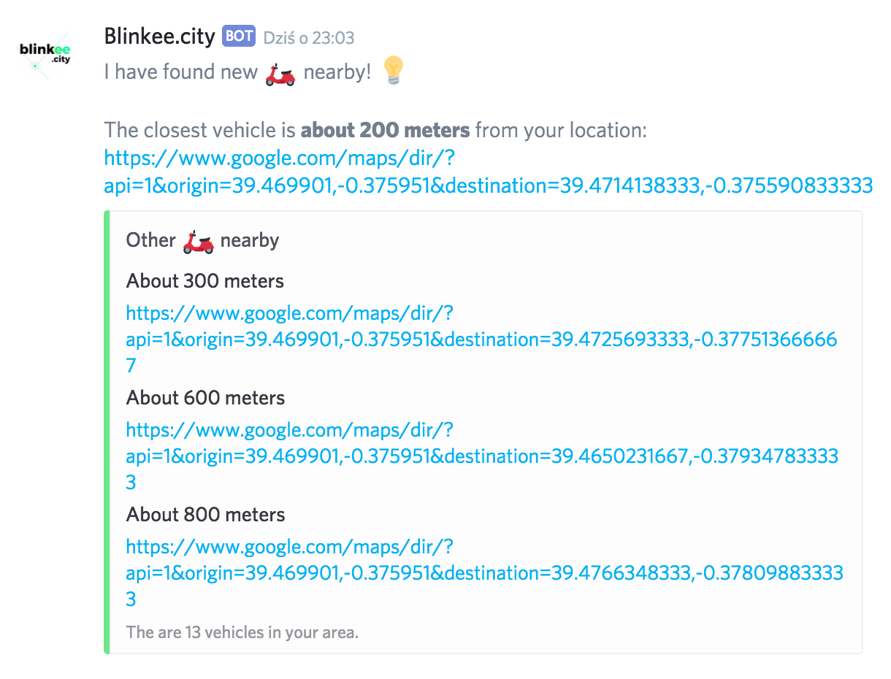

# Is [Blinkee](https://blinkee.city) nearby?

**This code is not an official application nor part of [Blinkee](https://blinkee.city)**.

The module notifies you if Blinkee vehicle appears near your location. Message with list of vehicles can be send to your Discord webhook.

## Installation

```bash
$ make
```

`Make` will install all requirements.

## Usage

### List of available regions

To display list of all available regions run command:

```bash
$ python is_blinkee_nearby.py --regions
```

It will output:

```
Available regions:

ID   Region
--   ------
1    Warszawa
2    Poznań
4    Kraków
...
```

### Find vehicles nearby

To find vehicles nearby run command:

```bash
$ python is_blinkee_nearby.py --search --origin <YOUR_LOCATION> --region <REGION_ID> --distance <DISTANCE_IN_METERS> [--webhook <WEBHOOK_URL>]
```

It will show list of available vehicles in your area (4 at most) and push message to given webhook (if necessary). Location should be separated by comma. Notification will not be send unless new vehicle has appeared in your area from last run.

```
The closest vehicle is about 200 meters from your location: https://www.google.com/maps/dir/?api=1&origin=39.469901,-0.375951&destination=39.4713396667,-0.375576166667

* Other vehicles nearby:
300 meters -> https://www.google.com/maps/dir/?api=1&origin=39.469901,-0.375951&destination=39.4726313333,-0.377461
600 meters -> https://www.google.com/maps/dir/?api=1&origin=39.469901,-0.375951&destination=39.4650741667,-0.379328666667
800 meters -> https://www.google.com/maps/dir/?api=1&origin=39.469901,-0.375951&destination=39.4765691667,-0.378029333333
```

#### Example Discord notification



## Requirements

* [requests](http://docs.python-requests.org/en/master/)

## Contributing

Did you find a bug or got an idea? Feel free to use the [issue tracker](//github.com/terenaa/is-blinkee-nearby/issues). Or make directly a [pull request](//github.com/terenaa/is-blinkee-nearby/pulls).

## Author & license

The code is written by Krzysztof Janda and is 100% FREE under MIT license.
